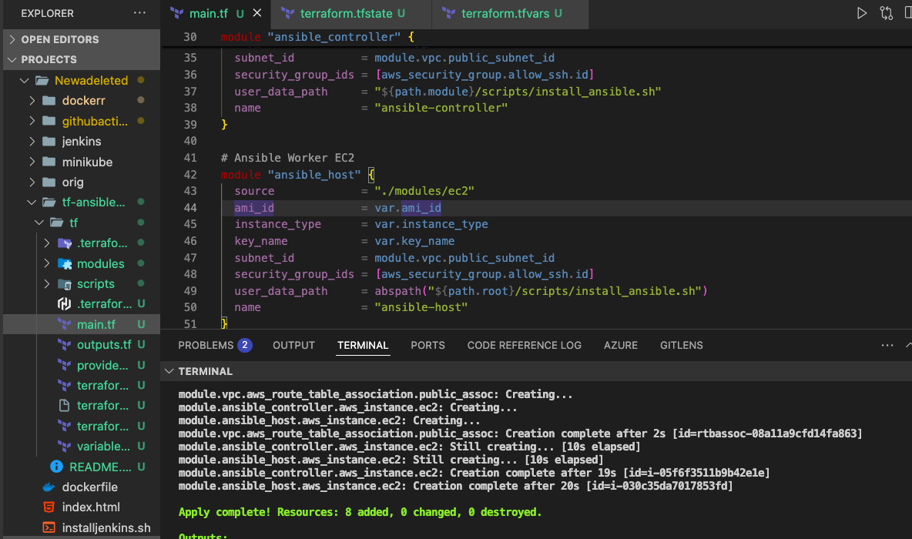
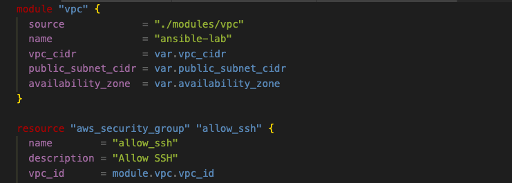
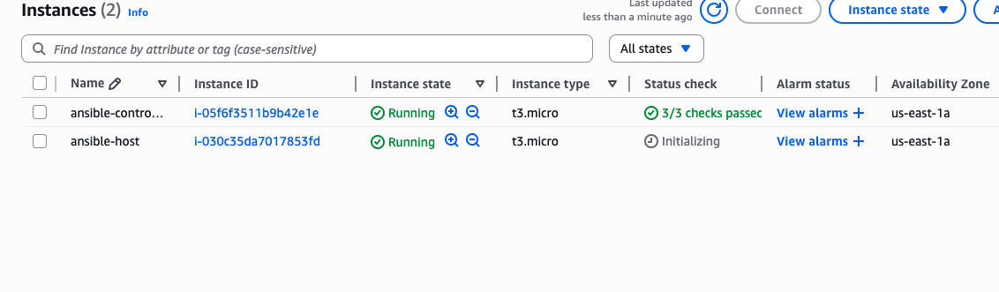
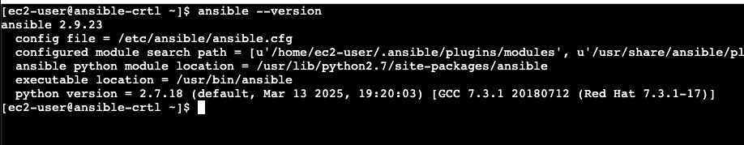
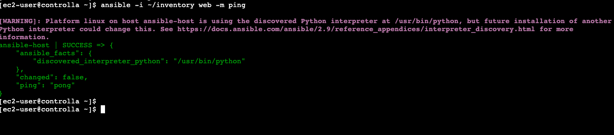
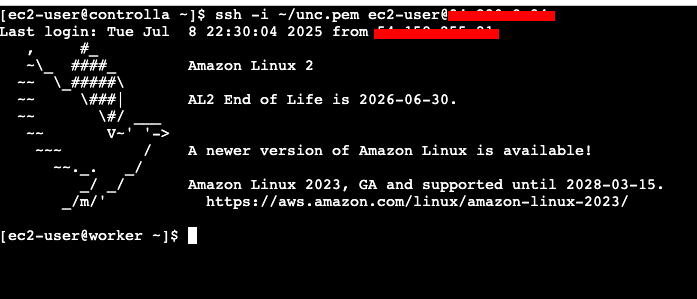
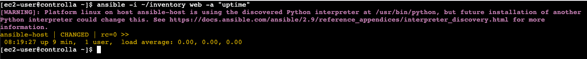
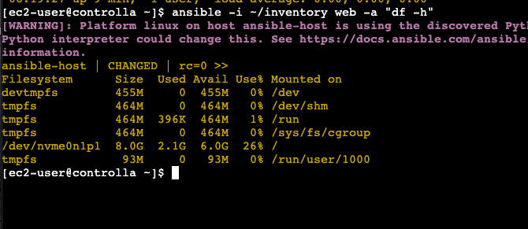
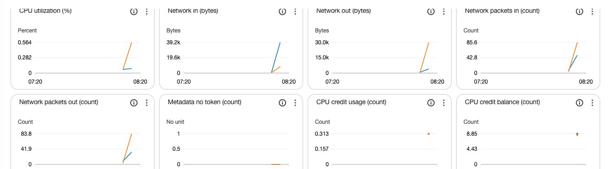

# Ansible 

Is a powerful automation tool that simplifies the management of IT infrastructure. Setting up Ansible on a Linux Server is the first step towards leveraging its capabilities. This will guide you through installing and configuring Ansible on a linux server, allowing ofr the automation of tasks and to manage servers effectively.

## Task 1

### Install Ansible on Controller

For configuration of Ansible and target/worker machine, terraform was used to set it entirely up. User-data scripts were used to install Anisble on the controller and python the worker. 
NB: To make sure python3 is installed on the worker.

The images below so the terraform structure alongside plan & apply commands applied

Next: The instances created and placed side by side.

### Configure SSH into target:worker
First, in the controller machine, a command is run to confirm the successful installation.

### Create inventory file for targert:worker

### Test Ansible connectivity
ssh is configured using the worker ip address added to the inventory file and the keypair

### Run simple AdHoc commands
Simple commands to;

Check Uptime:

Check disk space:

Additionally, manually monitoring was incorperated:

 